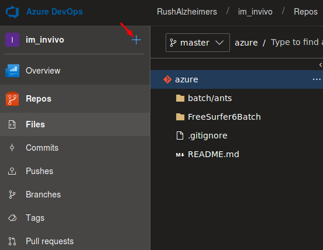
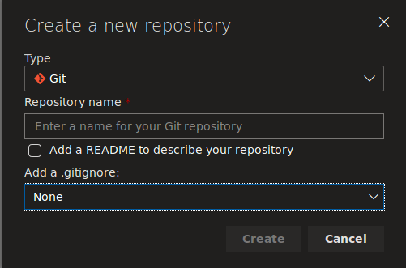
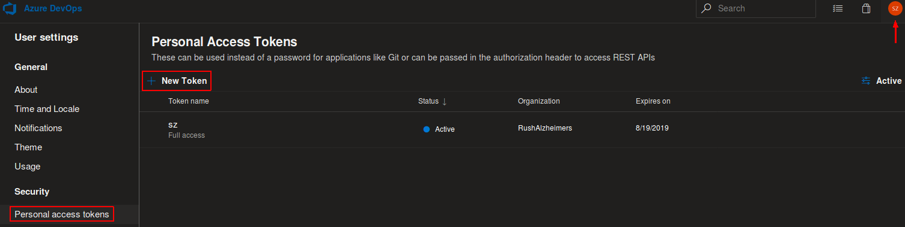
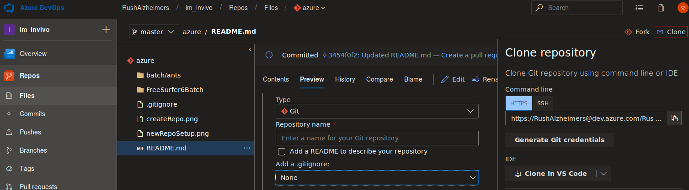
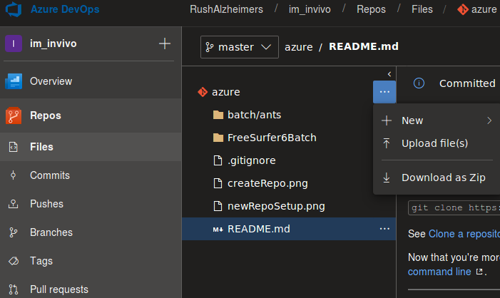
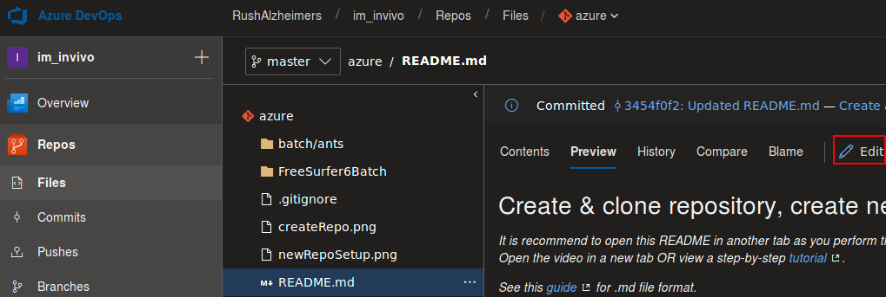

# Applications for Rush Alzheimer's Disease Center Neuroimaging core. The following is for Azure Devops, but also works for git CLI

## Create/clone repository, create/edit file, commit/push/pull

*It is recommend to open this README in another tab as you perform the tasks below. DevOps has a structure (top->down) organization -> project -> repos etc.. You can [watch this video](https://youtu.be/0ocf7u76WSo) for a full demo from bitbucket. Open the video in a new tab OR view a step-by-step [tutorial](https://www.atlassian.com/git/tutorials/learn-git-with-bitbucket-cloud).*

*See this [guide](https://bitbucket.org/tutorials/markdowndemo/) for .md file format.*

*Edited by Shengwei, subject to change w/o notice. N.b.: although this readme is originally for bitbucket, some functions still apply to other application, e.g. Azure DevOps.*

---

## Create a repository online

"Do the following to create your repository:"

1. From [DevOps](https://dev.azure.com/RushAlzheimers), click **Project > im_invivo > Repos (left drop down menu, see figure below) > '+' button (near im_invivo, see figure below) ** and select **New repository**.
2. Choose **Git** as **Type** and specify the name for the repo in the pop-up window (see figure below). Others as needed. Click "Create". May need admin permission to do so, contact admin if any problem.

---

## Clone a repository to local via git command-line

Cloning allows you to work on your files locally. Copy and connect the repository locally so that you can push updates you make and pull changes others make.

First create a [personal access token](https://dev.azure.com/RushAlzheimers/_usersSettings/tokens) as needed, then use it as usr/passwd below; or generate git credential by clicking the top right "Clone" button (see figure below, in high-lighted red box):

`git clone https://dev.azure.com/RushAlzheimers/im_invivo/_git/azure`

See [Clone a repository](https://confluence.atlassian.com/x/4whODQ) for details.

Now that you're more familiar with your DevOps repository, go ahead and add a new file locally.
You can [add, commit,](https://confluence.atlassian.com/x/8QhODQ) and [push from the command line](https://confluence.atlassian.com/x/NQ0zDQ).

---

## Create/upload a file online

Next, you'll add/upload a new file to this repository from DevOps portal.

1. Click the specific Repo Files tag on left and then the **...** button next to the repo name, choose 'upload' (see figure below).
2. Follow the instructions on screen and then click **Commit**.

---

## Edit a file online

You'll start by editing this README file to learn how to edit a file.

1. Click **Project > im_invivo > Repos** from [main page](https://dev.azure.com/RushAlzheimers).
2. Click the README.md link from the list of files.
3. Click the **Edit** button on top right (see figure below).
4. After making your change, click **Commit** to follow the instruction on screen and you'll see the change you just made.

---

## Modify/commit/push/check status of repository via git

1. For **first time user**, use "git config --global user.email <your email>" to let git know who you are.
2. Use `git add/rm -f <file>...` to **update what will be committed**.
3. Use `git reset HEAD <file>...` to **unstage files that are not transferred/uploaded**.
4. Use `git status` to **get the status of your local repository**.
5. Use `git commit -am '<your message>'` to **commit change(s) locally**.
6. Use `git push origin master` to **push changes remotely**.
7. Repeat steps 2 to 5 *after modifying repository files as needed*.
8. Use `git pull` to **obtain files changed remotely**.
9. Use `git remote rm origin; git remote add origin <http>` to **switch origin, e.g. from bitbucket to devops**.
10. Update git by [this](https://git-scm.com/download/linux), details under Ubuntu, i.e. `sudo add-apt-repository ppa:git-core/ppa;sudo apt update;sudo apt install git -y`.

